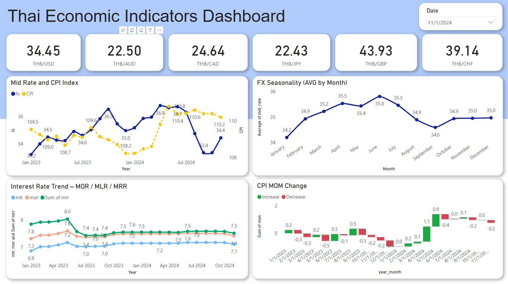

# FX Policy CPI Pipeline

Pipeline สำหรับดึงข้อมูลทางเศรษฐกิจจากแหล่งข้อมูลต่างๆ ประมวลผล และโหลดเข้า BigQuery

## ภาพรวม

Pipeline นี้ทำงานบน Apache Airflow โดยดึงข้อมูลจาก 3 แหล่งหลัก:
- **อัตราแลกเปลี่ยน (FX)** จากธนาคารแห่งประเทศไทย
- **ดัชนีราคาผู้บริโภค (CPI)** จากกระทรวงพาณิชย์
- **อัตราดอกเบี้ย (Interest Rate)** จากธนาคารแห่งประเทศไทย

## โครงสร้าง Pipeline

```
[get_fx_data]     [get_cpi_data]     [get_int_data]
      |                 |                    |
      +-----------------|--------------------+
                        ↓
                  [merge_data]
                        |
            +-----------+-----------+
            ↓                       ↓
    [load_fx_to_bigquery]   [load_cpi_int_to_bigquery]
```

## Tasks

### 1. get_fx_data
ดึงข้อมูลอัตราแลกเปลี่ยนสกุล USD จาก BOT API
- **ช่วงเวลา**: มกราคม 2023 - พฤศจิกายน 2024
- **Output**: `fx_data.parquet`
- **API Endpoint**: BOT Monthly Average Exchange Rate

### 2. get_cpi_data
ดึงข้อมูลดัชนีราคาผู้บริโภค (CPI) จาก MOC API
- **ช่วงเวลา**: 2023 - 2024
- **Region**: ทั่วประเทศ (region_id = 5)
- **Output**: `cpi_data.parquet`
- **API Endpoint**: MOC CPIU Indexes

### 3. get_int_data
ดึงข้อมูลอัตราดอกเบี้ยเฉลี่ยรายเดือนจาก BOT API
- **ช่วงเวลา**: มกราคม 2023 - พฤศจิกายน 2024
- **ดัชนี**: MOR, MLR, MRR, Ceiling Rate, Default Rate, Credit Card Rate
- **Output**: `int_data.parquet`
- **API Endpoint**: BOT Average Loan Rate

### 4. merge_data
รวมข้อมูล CPI และ Interest Rate เข้าด้วยกัน
- **Join Key**: year_month
- **Output**: `cpi_int_data.parquet`

### 5. load_fx_to_bigquery
โหลดข้อมูล FX เข้า BigQuery
- **Destination**: `DM_PROD.fx_data`
- **Write Mode**: WRITE_TRUNCATE (เขียนทับข้อมูลเดิม)

### 6. load_cpi_int_to_bigquery
โหลดข้อมูล CPI + Interest Rate เข้า BigQuery
- **Destination**: `DM_PROD.cpi_int_data`
- **Write Mode**: WRITE_TRUNCATE (เขียนทับข้อมูลเดิม)

## Configuration

### API Keys
ต้องมี API Keys สำหรับเชื่อมต่อกับ BOT API:
```python
FX_API_KEY = "eyJvcmciOi..."
INT_API_KEY = "eyJvcmciOi..."
```

### Output Paths
ไฟล์ Parquet จะถูกบันทึกที่:
```python
fx_output_path = "/home/airflow/gcs/data/fx_data.parquet"
cpi_output_path = "/home/airflow/gcs/data/cpi_data.parquet"
int_output_path = "/home/airflow/gcs/data/int_data.parquet"
cpi_int_output_path = "/home/airflow/gcs/data/cpi_int_data.parquet"
```

### GCS Bucket
```
Bucket: us-central1-fxpipeline-908e3388-bucket
Path: data/
```

## Data Schema

### fx_data
| Column | Type | Description |
|--------|------|-------------|
| period | string | รอบเดือน (YYYY-MM) |
| currency_id | string | รหัสสกุลเงิน |
| avg_rate | float | อัตราแลกเปลี่ยนเฉลี่ย |

### cpi_int_data
| Column | Type | Description |
|--------|------|-------------|
| base_year | string | ปีฐาน |
| price_index | float | ดัชนีราคา |
| mon | float | % เปลี่ยนแปลงเทียบเดือนก่อน |
| yoy | float | % เปลี่ยนแปลงเทียบปีก่อน |
| aoa | float | % เปลี่ยนแปลงเฉลี่ย |
| year_month | string | รอบเดือน (YYYY-MM) |
| mor | float | MOR (Maximum Overdraft Rate) |
| mlr | float | MLR (Minimum Loan Rate) |
| mrr | float | MRR (Minimum Retail Rate) |
| ceiling_rate | float | อัตราดอกเบี้ยสูงสุด |
| default_rate | float | อัตราดอกเบี้ยผิดนัด |
| creditcard_min | float | อัตราดอกเบี้ยบัตรเครดิตต่ำสุด |
| creditcard_max | float | อัตราดอกเบี้ยบัตรเครดิตสูงสุด |

## Requirements

```
apache-airflow
pandas
requests
google-cloud-storage
google-cloud-bigquery
apache-airflow-providers-google
apache-airflow-providers-mysql
urllib3
pyarrow
```

## Schedule

- **Schedule**: `@once` (รันครั้งเดียว)
- **Start Date**: 1 วันที่แล้ว

## การใช้งาน

1. ตรวจสอบว่ามี API Keys ที่ถูกต้อง
2. ตรวจสอบ GCS bucket และ BigQuery dataset
3. Trigger DAG ใน Airflow UI
4. ตรวจสอบ logs ของแต่ละ task
5. ตรวจสอบข้อมูลใน BigQuery

## Error Handling

Pipeline มีการจัดการ error ดังนี้:
- Request timeout: 30 วินาที
- SSL verification: ปิดการใช้งาน (verify=False)
- API rate limiting: หน่วงเวลา 1 วินาทีระหว่างการเรียก API
- Data validation: ตรวจสอบข้อมูลก่อน save

## Dashboard

ได้มีการนำข้อมูลที่ได้จาก Pipeline ไปสร้าง Dashboard เพื่อแสดงผลข้อมูลเศรษฐกิจไทย ดังนี้:



