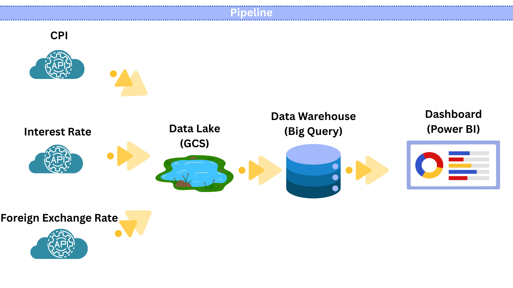
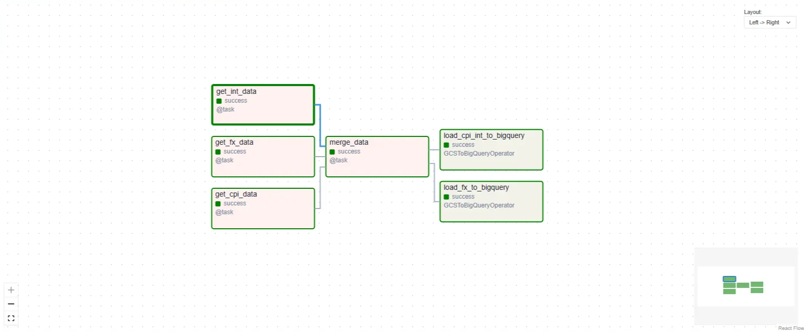

# Thai Economic Indicators Pipeline

## Introduction

This data pipeline provides comprehensive economic indicators that are essential for understanding Thailand's macroeconomic conditions and making informed financial decisions. The pipeline collects and integrates three critical economic metrics:

- **Foreign Exchange Rates (FX)**: Helps track currency valuation, import/export competitiveness, and foreign investment trends
- **Consumer Price Index (CPI)**: Measures inflation rates and cost of living changes, crucial for monetary policy decisions and purchasing power analysis
- **Interest Rates**: Indicates the cost of borrowing and return on savings, affecting investment decisions, loan pricing, and overall economic activity

This integrated dataset enables:

- **Economic analysts** to monitor macroeconomic trends and relationships between key indicators
- **Financial institutions** to assess market conditions for lending and investment strategies
- **Business planners** to forecast costs, pricing strategies, and market conditions
- **Policy makers** to evaluate the effectiveness of monetary policies
- **Researchers** to study correlations between exchange rates, inflation, and interest rates

The data reveals important economic relationships, such as how currency fluctuations relate to inflation pressures and how interest rate adjustments impact both currency values and price levels.

---

## Overview

This is an automated data pipeline built on Apache Airflow that extracts economic data from multiple official sources, processes it, and loads it into BigQuery for analysis.

### Data Sources

The pipeline retrieves data from 3 primary sources:

- **Foreign Exchange Rates (FX)** from the Bank of Thailand (BOT)
- **Consumer Price Index (CPI)** from the Ministry of Commerce (MOC)
- **Interest Rates** from the Bank of Thailand (BOT)

## Pipeline Architecture



## Tasks

### Airflow Directed Acyclic Graphs (DAG)



### 1. get_fx_data

Retrieves USD exchange rate data from BOT API

- **Time Period**: January 2023 - November 2024
- **Output**: `fx_data.parquet`
- **API Endpoint**: BOT Monthly Average Exchange Rate

### 2. get_cpi_data

Retrieves Consumer Price Index (CPI) data from MOC API

- **Time Period**: 2023 - 2024
- **Region**: Nationwide (region_id = 5)
- **Output**: `cpi_data.parquet`
- **API Endpoint**: MOC CPIU Indexes

### 3. get_int_data

Retrieves monthly average interest rate data from BOT API

- **Time Period**: January 2023 - November 2024
- **Indicators**: MOR, MLR, MRR, Ceiling Rate, Default Rate, Credit Card Rate
- **Output**: `int_data.parquet`
- **API Endpoint**: BOT Average Loan Rate

### 4. merge_data

Merges CPI and Interest Rate data

- **Join Key**: year_month
- **Output**: `cpi_int_data.parquet`

### 5. load_fx_to_bigquery

Loads FX data into BigQuery

- **Destination**: `DM_PROD.fx_data`
- **Write Mode**: WRITE_TRUNCATE (overwrites existing data)

### 6. load_cpi_int_to_bigquery

Loads CPI + Interest Rate data into BigQuery

- **Destination**: `DM_PROD.cpi_int_data`
- **Write Mode**: WRITE_TRUNCATE (overwrites existing data)

## Configuration

### API Keys

API Keys are required to connect to BOT API:

```python
FX_API_KEY = "eyJvcmciOi..."
INT_API_KEY = "eyJvcmciOi..."
```

### Output Paths

Parquet files are saved to:

```python
fx_output_path = "/home/airflow/gcs/data/fx_data.parquet"
cpi_output_path = "/home/airflow/gcs/data/cpi_data.parquet"
int_output_path = "/home/airflow/gcs/data/int_data.parquet"
cpi_int_output_path = "/home/airflow/gcs/data/cpi_int_data.parquet"
```

### GCS Bucket

```
Bucket: us-central1-fxpipeline-908e3388-bucket
Path: data/
```

## Data Schema

### fx_data

| Column      | Type   | Description            |
| ----------- | ------ | ---------------------- |
| period      | string | Month period (YYYY-MM) |
| currency_id | string | Currency code          |
| avg_rate    | float  | Average exchange rate  |

### cpi_int_data

| Column         | Type   | Description                  |
| -------------- | ------ | ---------------------------- |
| base_year      | string | Base year                    |
| price_index    | float  | Price index                  |
| mon            | float  | % change from previous month |
| yoy            | float  | % change from previous year  |
| aoa            | float  | Average % change             |
| year_month     | string | Month period (YYYY-MM)       |
| mor            | float  | MOR (Maximum Overdraft Rate) |
| mlr            | float  | MLR (Minimum Loan Rate)      |
| mrr            | float  | MRR (Minimum Retail Rate)    |
| ceiling_rate   | float  | Maximum interest rate        |
| default_rate   | float  | Default interest rate        |
| creditcard_min | float  | Minimum credit card rate     |
| creditcard_max | float  | Maximum credit card rate     |

## Requirements

```
apache-airflow
pandas
requests
google-cloud-storage
google-cloud-bigquery
apache-airflow-providers-google
apache-airflow-providers-mysql
urllib3
pyarrow
```

## Schedule

- **Schedule**: `@once` (runs once)
- **Start Date**: 1 day ago

## Usage

1. Verify that you have the correct API Keys
2. Check GCS bucket and BigQuery dataset
3. Trigger the DAG in Airflow UI
4. Monitor logs for each task
5. Verify data in BigQuery

## Error Handling

The pipeline includes error handling for:

- Request timeout: 30 seconds
- SSL verification: Disabled (verify=False)
- API rate limiting: 1 second delay between API calls
- Data validation: Validates data before saving

## Dashboard

The data from this pipeline has been used to create a dashboard displaying Thai economic indicators:


This dashboard illustrates the interconnections between currency values, inflation, and interest rates in the economic system. The Thai Baht shows volatility based on market conditions, while CPI reflects changes in the cost of living, and interest rates play a crucial role in capital flows and FX markets. By analyzing volatility, seasonal patterns, return distributions, and correlations between all variables, we gain a more comprehensive understanding of economic mechanisms. This includes observing how the Thai Baht, adjusted for inflation, moves in a direction closely aligned with fundamental economic conditions.
